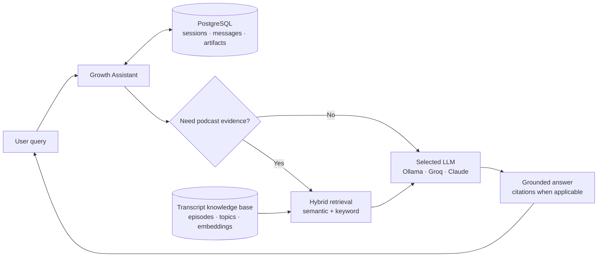
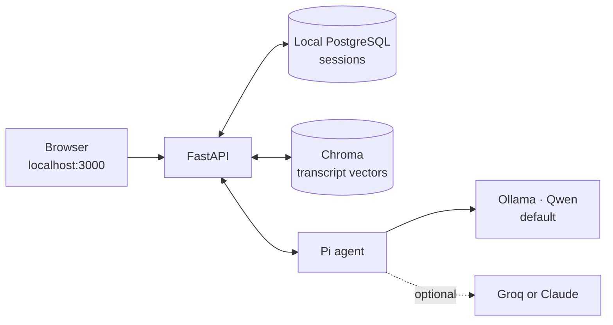
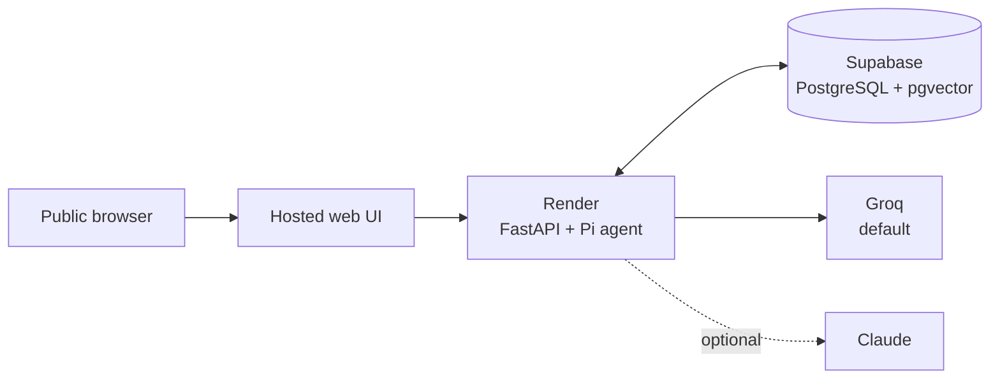

# Architecture

Lenny's Growth Assistant is one product with two deployment profiles. The query, agent, retrieval, grounding, and persistence contracts stay the same; only the infrastructure and configured model providers change.

## Query dataflow



Every turn reaches FastAPI and the Pi agent with recent session history. The agent classifies the turn as direct conversation, corpus catalog lookup, transcript research, or Ship 30 generation. Direct conversation does not search the corpus. Research resolves guest/topic context dynamically, retrieves evidence, and makes only those passages available to the selected model. FastAPI validates grounding and exposes sources only when transcript evidence was actually used.

## Local deployment



Docker Compose starts the web UI, FastAPI, Pi agent, PostgreSQL, and Chroma. Ollama runs on the evaluator's host and is reached through `host.docker.internal`. The repository contains `episodes/` and `index/`, which are mounted read-only for ingestion. All published ports bind to `127.0.0.1`. Groq and Claude are optional providers enabled through `.env`; Ollama remains independently usable without a cloud key.

## Cloud deployment



The public frontend calls the Render backend. One Render image runs FastAPI on the public port and Pi on loopback. Supabase provides PostgreSQL and pgvector for conversations, evidence, and retrieval. Groq is the hosted default; Claude can be enabled with an evaluator-supplied key. Cloud configuration changes infrastructure, not agent behavior or API contracts.

## Component boundaries

| Component | Owns |
|---|---|
| Web | Profile sign-in, sessions, chat, provider selection, sources, artifact workspace |
| FastAPI | Authentication, persistence, retrieval, grounding checks, artifacts, health |
| Pi agent | Intent routing, model conversation, bounded tool selection |
| PostgreSQL | Users, sessions, messages, evidence metadata, tool runs, artifacts |
| Chroma / pgvector | Rebuildable dense transcript index |
| Ollama / Groq / Claude | Explicitly selected generation provider |

## Ingestion and retrieval

The Markdown transcripts remain the source of truth. Ingestion parses speakers and timestamps, removes advertisements/outros, and groups original turns into conversational evidence units without rewriting them with an LLM.

For research queries:

1. The agent resolves any guest, episode, or topic from the live corpus catalog.
2. Keyword search and dense-vector search produce independent candidates.
3. Rank fusion, metadata constraints, relevance scoring, and episode diversity select the evidence set.
4. Stable evidence IDs recover the original transcript passages and timestamps.
5. The model answers from that evidence; unsupported claims are rejected or the system abstains.

Local dense retrieval uses `nomic-embed-text` with Chroma. The cloud profile uses pgvector with deterministic feature-hash embeddings by default; the Supabase `gte-small` function is an optional upgrade. Topic indexes act as retrieval priors, while episode transcripts remain the evidence.

## Agent tools and model selection

Pi exposes only four application tools:

- corpus catalog browsing;
- transcript search;
- source-context expansion;
- Ship 30 essay preparation.

The chosen provider is explicit and recorded with the answer. Local Ollama uses Qwen with thinking disabled. Groq and Claude use the same routing and tools, so changing the model does not change session history or transcript data. A genuine Groq HTTP 429 may retry on the configured smaller Groq fallback; other failures never silently switch providers.

## Persistence and schema

```text
users 1 ── * chat_sessions 1 ── * messages
                    │  ├────── * artifacts
                    │  └────── * tool_runs
episodes 1 ── * evidence_units
    └──── * episode_topics
```

Every session query is scoped to its user. Messages record provider, model, execution mode, and grounding metadata. An artifact is tied to the assistant message that created it and copies its evidence bundle, so later retrieval changes cannot alter its provenance.

## API surface

- `POST /api/client`, `POST /api/login` — obtain an anonymous or profile token.
- `GET|POST /api/sessions`, `PATCH|DELETE /api/sessions/{id}` — session lifecycle.
- `GET /api/sessions/{id}/messages` — ordered conversation history.
- `POST /api/chat` — adaptive agent turn with answer, sources, tools, model, and latency.
- `GET|POST /api/sessions/{id}/artifacts` — grounded Markdown artifacts.
- `GET /api/sources/{id}` — resolve an evidence unit.
- `GET /health/live`, `GET /health/ready`, `GET /api/config` — runtime readiness.
- `/internal/tools/*` — token-protected endpoints used only by Pi.

## Security and grounding boundaries

- Transcripts are treated as evidence, never as executable instructions.
- Public session and artifact access is user-scoped.
- Internal tool endpoints require a shared service token.
- The browser never receives model keys, database credentials, profile passwords, or signing secrets.
- Tool calls, history, source expansion, and artifact generation are bounded.
- Provider responses and logs exclude secrets and complete prompts.
- Sources appear only after retrieval, and source IDs must match evidence returned during the same run.
